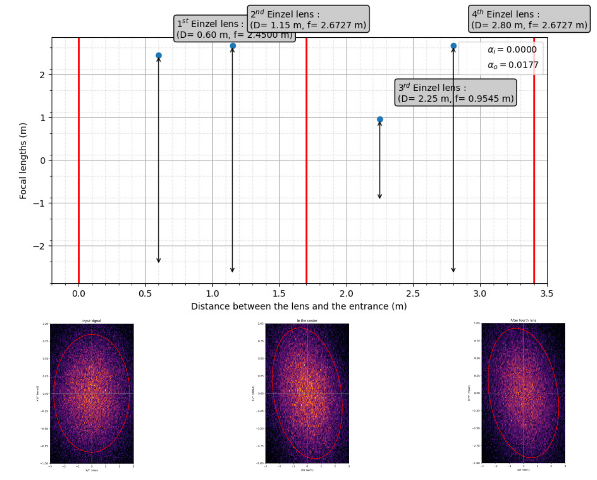

# Ion optics

Attribution-NonCommercial-NoDerivatives 4.0 International (CC BY-NC-ND 4.0)

### Optimization of Twiss parameters to influence the emissivity of an ion beam

Programs developed during an internship in ion optics to discover the notion of emissivity, Twiss parameters and "sigma" matrices for ion beams passing through different optical systems (drift, thin lens, Einzel lens, magnetic dipole, electrostatic quadrupole).

The parameters are given in **parameters.py**, which allows to change the values of the optical elements. The Twiss parameter "gamma" is calculated in **gamma.py**.

All sigma matrices have been calculated beforehand according to the transfer matrix of the different optical elements used. They are recorded in **sigma_matrices.py**.

Finally, the ellipses are displayed thanks to the code coming from <a href="https://matplotlib.org/3.1.0/gallery/statistics/confidence_ellipse.html" title="this website">this website</a>, from which I took inspiration.

In order to visualize them, you just have to compile the file **confidence_ellipse.py**. You can modify the ellipses to display by copying the sigma matrix code from the **sigma_matrices.py** file in this viewing program.

* * *

### Visualization of beam ellipses at the output of the different optical elements.

* * *

### Optimizations

In this part I'm going to simulate a double quadruple pole (approximated by a lens with drifts) in which I'm going to insert a parallel beam. The goal is to find two combinations of voltages to be applied to the quadripoles and which allow to have a beam as parallel as possible.
The black areas on the graph allow us to visualise the voltage curves which, combined, allow us to minimise the angle variation at the output of the quadrupole.
On the graph, only voltage values between 0 V and 2000 V are taken into account.
However, it is possible to apply a negative voltage, but in this case the pairs of values will be symmetrical with respect to 0.
value pairs with respect to 0.

You can see a fork in the surface. This fork would mean that for one voltage value for the second quadrupole, there are two voltage possibilities for the first quadrupole that would minimise the divergence.
Before we wrote this program we had no way of considering this property. This 3D representation is therefore most instructive. We will check this new property by taking
values (pairs which are shown in red).

* * *

In this part I will simulate a tunnel of 3.4 m in which 4 Einzel lenses are placed. The goal is to find the focal lengths of these lenses which allow to have a beam as parallel as possible at the exit.
Using the property that a beam keeps a constant area if it has no loss, the Python program I have made will only focus on the divergence term of the output sigma matrix. Indeed, by searching for the focal length values so that α output is as close as possible to α input, we make the output beam as similar as possible to the input beam.

The figure shows the focal lengths required for the four Einzel lenses in our system.
We can also see how the beam looks when it enters (left), in the centre of the system (middle) and when it leaves (right). The beam is almost not deflected if we consider that it has passed through 4 lenses which will act as shown in the figure. There is only a slight dispersion with respect to the input beam. We can therefore consider that the result is acceptable. One can also notice a decrease in the density of the output beam compared to the input. This is due to the fact that the system cannot be perfect and that there are still losses. But we can
But we can consider that for a beam which crosses 3.4 m of lenses, they remain negligible.

For more informations, please contact me.
