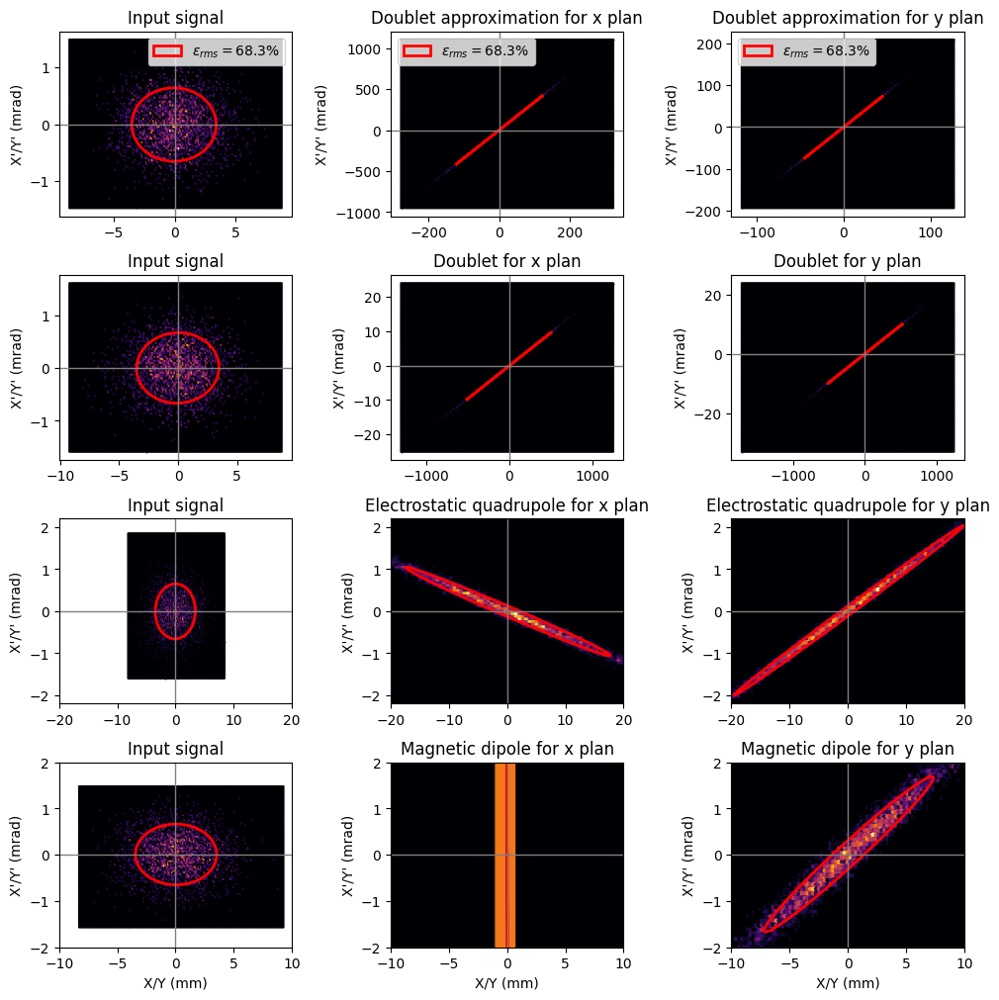
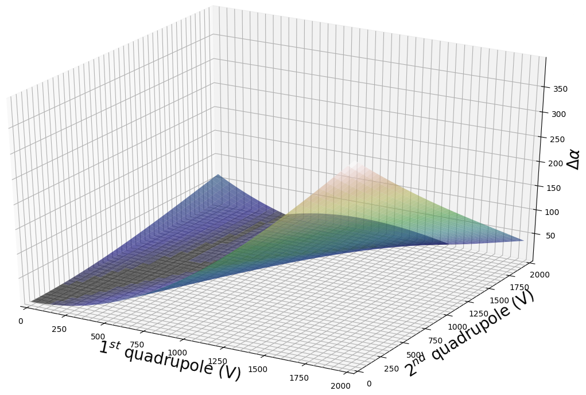

# Ion optics

Attribution-NonCommercial-NoDerivatives 4.0 International (CC BY-NC-ND 4.0)

### Optimization of Twiss parameters to influence the emissivity of an ion beam

Programs developed during an internship in ion optics to discover the notion of emissivity, Twiss parameters and "sigma" matrices for ion beams passing through different optical systems (drift, thin lens, Einzel lens, magnetic dipole, electrostatic quadrupole).

The parameters are given in **parameters.py**, which allows to change the values of the optical elements. The Twiss parameter "gamma" is calculated in **gamma.py**.

All sigma matrices have been calculated beforehand according to the transfer matrix of the different optical elements used. They are recorded in **sigma_matrices.py**.

Finally, the ellipses are displayed thanks to the code coming from <a href="https://matplotlib.org/3.1.0/gallery/statistics/confidence_ellipse.html" title="this website">this website</a>, from which I took inspiration. 

In order to visualize them, you just have to compile the file **confidence_ellipse.py**. You can modify the ellipses to display by copying the sigma matrix code from the **sigma_matrices.py** file in this viewing program.

---

### Visualization of beam ellipses at the output of the different optical elements.

---

### Optimizations
In this part I'm going to simulate a double quadruple pole (approximated by a lens with drifts) in which I'm going to insert a parallel beam. The goal is to find two combinations of voltages to be applied to the quadripoles and which allow to have a beam as parallel as possible.

---

In this part I will simulate a tunnel of 3.4 m in which 4 Einzel lenses are placed. The goal is to find the focal lengths of these lenses which allow to have a beam as parallel as possible at the exit. 

For more informations, please contact me.
